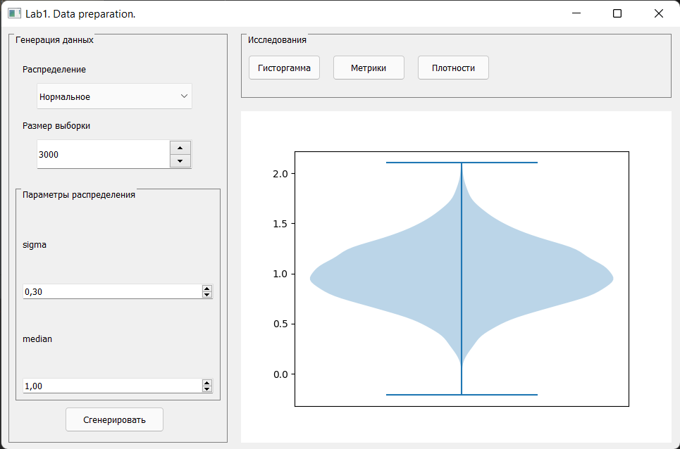
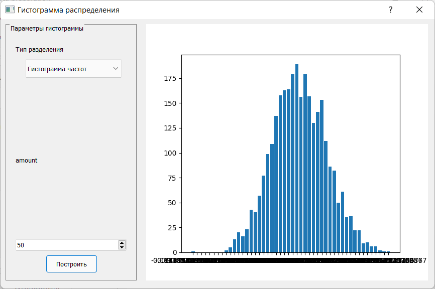
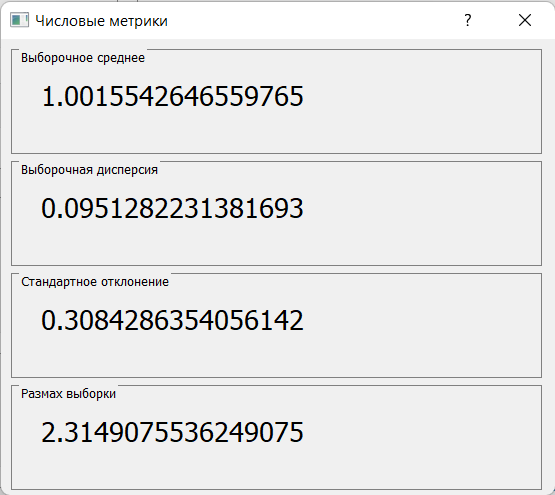
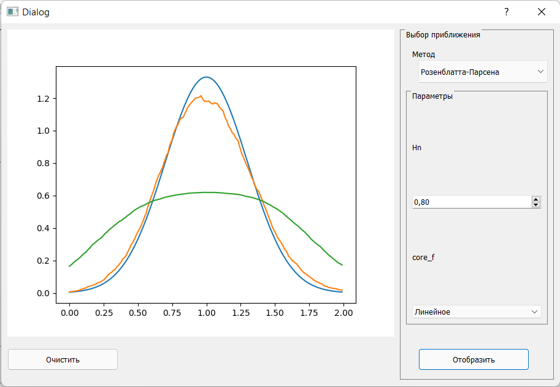

# Лабораторная работа "Генерация и исследование случайных распределений"
Пакет предоатсвляет модульный и расширяемый инструмент генрации и исследования случайных распределений

## Have fun!
If you find this code useful, I will be glad if you use it in your GPL3-compatible licensed project.

**"Why GPL-3. Author, are you too proud?"**
> Nope. It's just that I'm fighting for free software, and any possibility that someone else is using my code on a project that people, myself included, will have to pay for is unacceptable.
> My code is neither perfect nor revolutionary. But the world is crazy, you know

Any help and criticism is greatly appreciated.

## Использование

Можно сгенерировать распределение, задав параметры для каждого из выбранных распределений

### Сгенерированное распределение исследуется:

Гистограммы частот и относительных частот

Численные метрики

Оценка плотности методом Розенблатта-Парсена с возможностью выбора ядерной функции оценки и задания ее параметров

## Зависимости
* python >= 3.9
* PyQt5
* matplotlib
